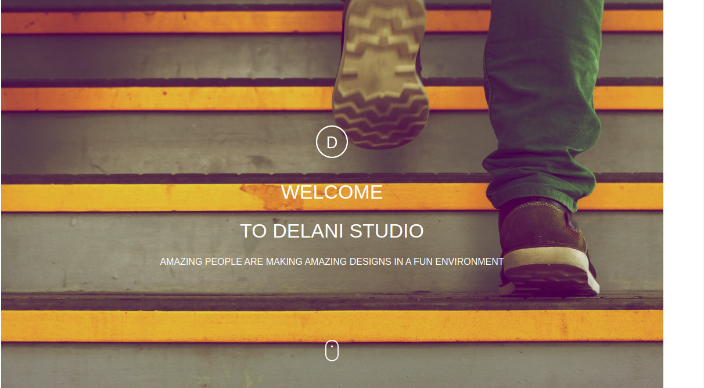
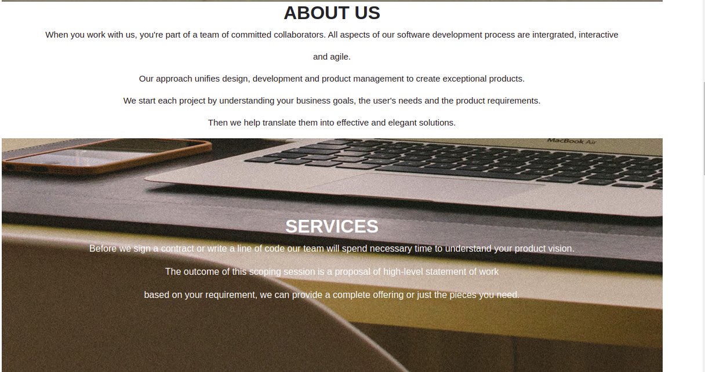
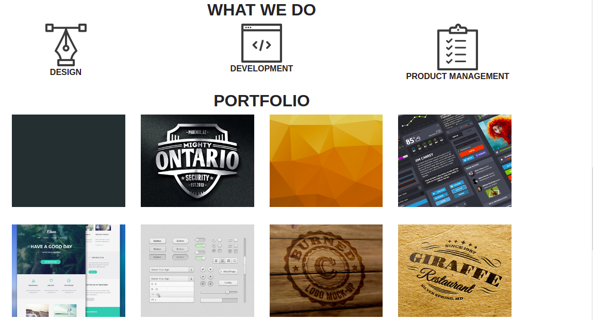
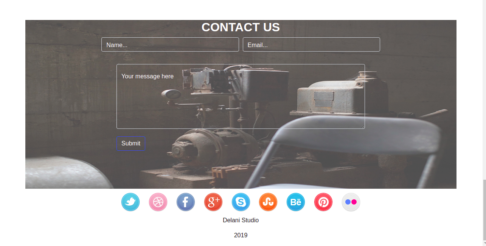

# DELANI STUDIO
#### It's about Delani Studio, a software developer company, featuring what they do.
#### By Laurette Mong'ina.
## https://laurettemongina.github.io/Delani_studio/
## Delani Studio
Delani Studio is a web application on a software developing company. It has a landing page, about us page, what we do page and a contact page.
In the what we do, we have the services they provide, which is design, development and product management.
The portfolio section has some of the works they have done before.
The contact page has a from you can fill incase you want to reach out to them.

## Requirements
<ul>
<li>A code editor(vscode)</li>
<li>A github account</li>
<li>Internet.</li>
</ul>

## Setup/Installation
<ul>
<li>Clone this repository to your machine</li>
<li>Navigate to the top level of your directory.</li>
<li>Open the index.html in your browser</li>
</ul>

## Known Bugs
The web application runs well.
## Technologies Used
I used HTML,CSS and Java Script to create this Delani Studio. HTML for the structure and css for the styling. Javascript to validate the form and bootstrap for the grid system and button classes. I used vscode as my code editor and deployed on Github.
## Support and contact details
In case of any issues or you have question, concerns, ideas to implement and contributions, be sure to reach out to me via email (monginalaurette@gmail.com). Any contributions will be highly appreciated.Pull requests are highly welcome.
### License
[MIT].
Copyright (c) 2021 by Laurette Mong'ina.